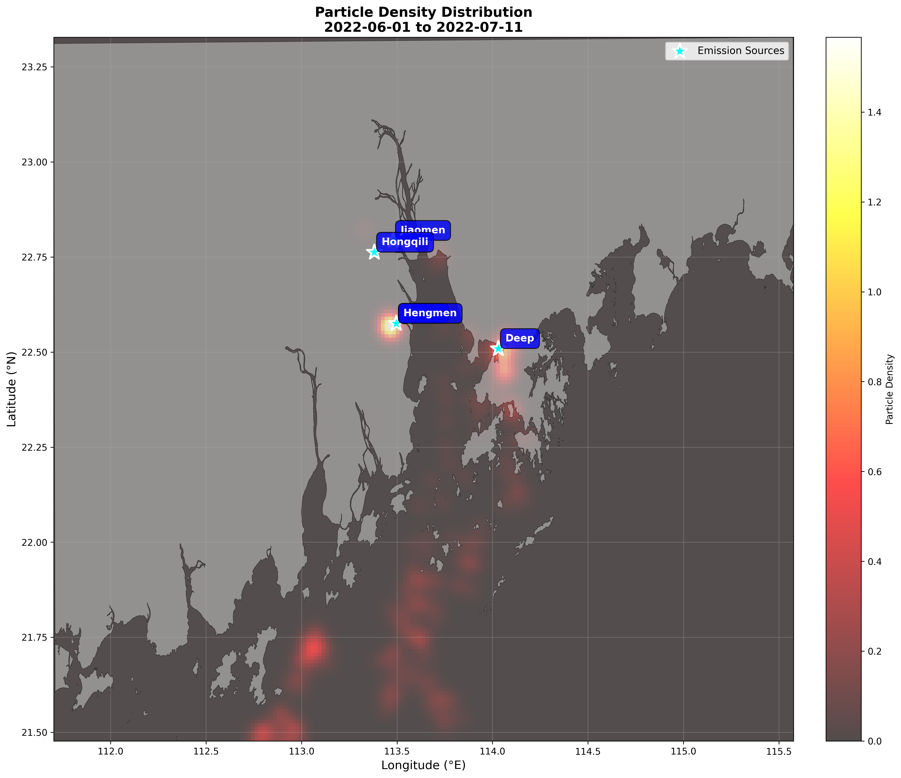
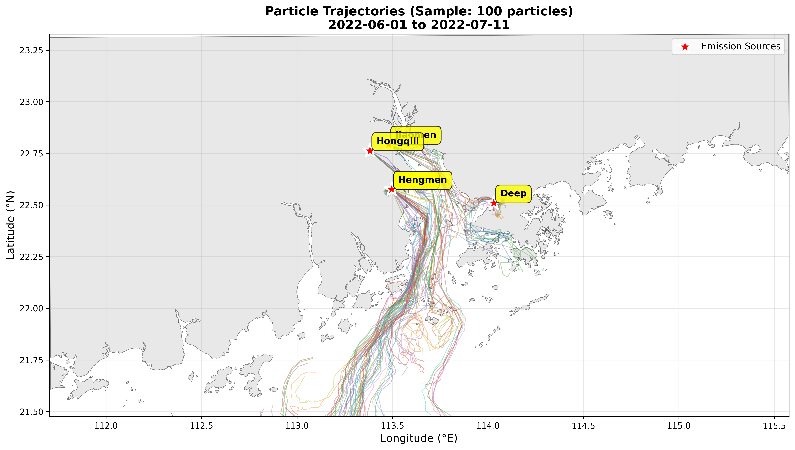

# Simple Particle Tracker

[](https://www.python.org/)
[](LICENSE)

一个专门为大型 Delft3D FM 水动力模型输出设计的高效拉格朗日粒子追踪系统。

## ✨ 特点

- ✅ **处理超大文件**: 测试过 307GB NetCDF 文件
- ✅ **内存优化**: 检查点机制防止数据丢失
- ✅ **坐标精确**: 正确处理经纬度 ↔ 米转换
- ✅ **3D流场**: 支持分层流速（表层/底层/深度平均）
- ✅ **自动可视化**: 生成带地理底图的密度图和轨迹图

## 🚀 快速开始

### 安装依赖

```bash
pip install numpy pandas scipy netCDF4 matplotlib geopandas tqdm
```

### 运行示例

```bash
# 1. 配置参数
# 编辑 optimized_tracking.py 中的文件路径和参数

# 2. 运行追踪
python optimized_tracking.py

# 3. 生成带底图的可视化
python visualize_with_basemap.py
```

## 📊 结果示例




*粒子密度分布图和轨迹图（珠江三角洲，2022年6-7月）*

## 📖 详细文档

查看 [claude.md](claude.md) 获取完整的使用指南，包括：

- 工作原理和数学模型
- 参数配置详解
- 常见问题解答
- 性能优化建议

## 🎯 适用场景

- 河口污染物扩散模拟
- 海洋示踪剂追踪
- 搜救路径预测
- 油污扩散分析

## 🔧 技术栈

- **Python 3.8+**
- NumPy & SciPy (数值计算)
- NetCDF4 (数据读取)
- GeoPandas (地理数据处理)
- Matplotlib (可视化)

## 📁 项目结构

```
particle_tracking/
├── optimized_tracking.py              # 核心追踪脚本
├── visualize_with_basemap.py          # 可视化脚本
├── PRD.shp (及相关文件)               # 珠江三角洲底图
├── claude.md                          # 详细技术文档
└── optimized_results/                 # 结果输出
```

## 🤝 贡献

欢迎提交 Issue 和 Pull Request！

## 📝 许可证

MIT License

## 🙏 致谢

- Delft3D Flexible Mesh 水动力模型
- Parcels 项目启发了部分设计思路

---

**开发环境**: Windows 10, Python 3.13, Delft3D FM 1.2.95
**最后更新**: 2024-12-28
